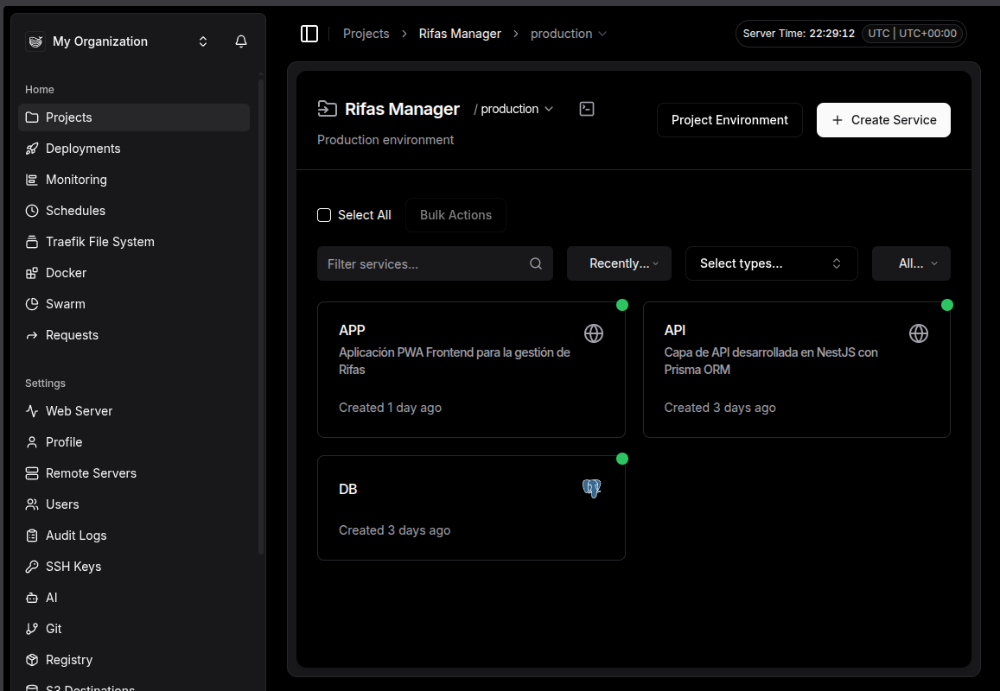
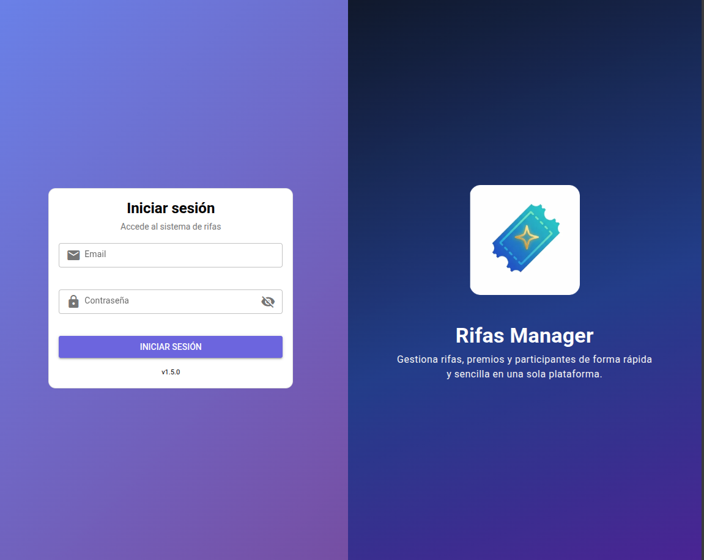
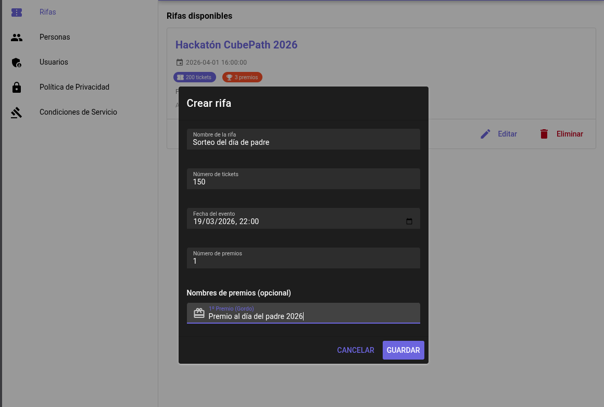
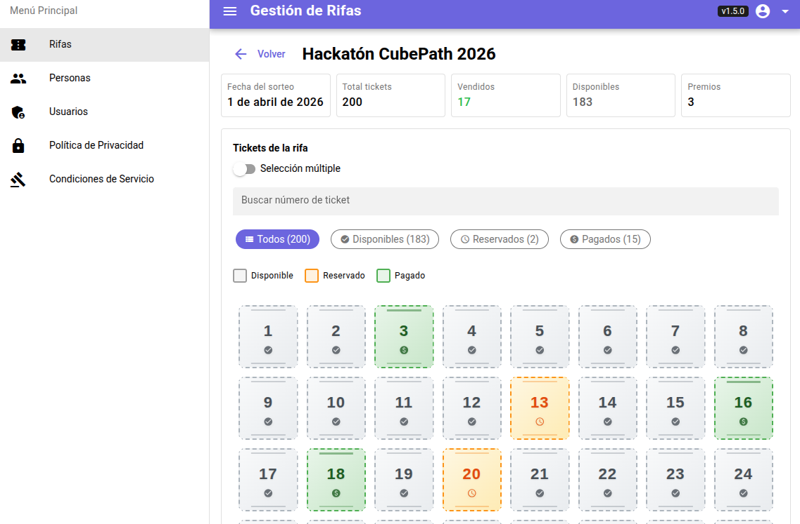
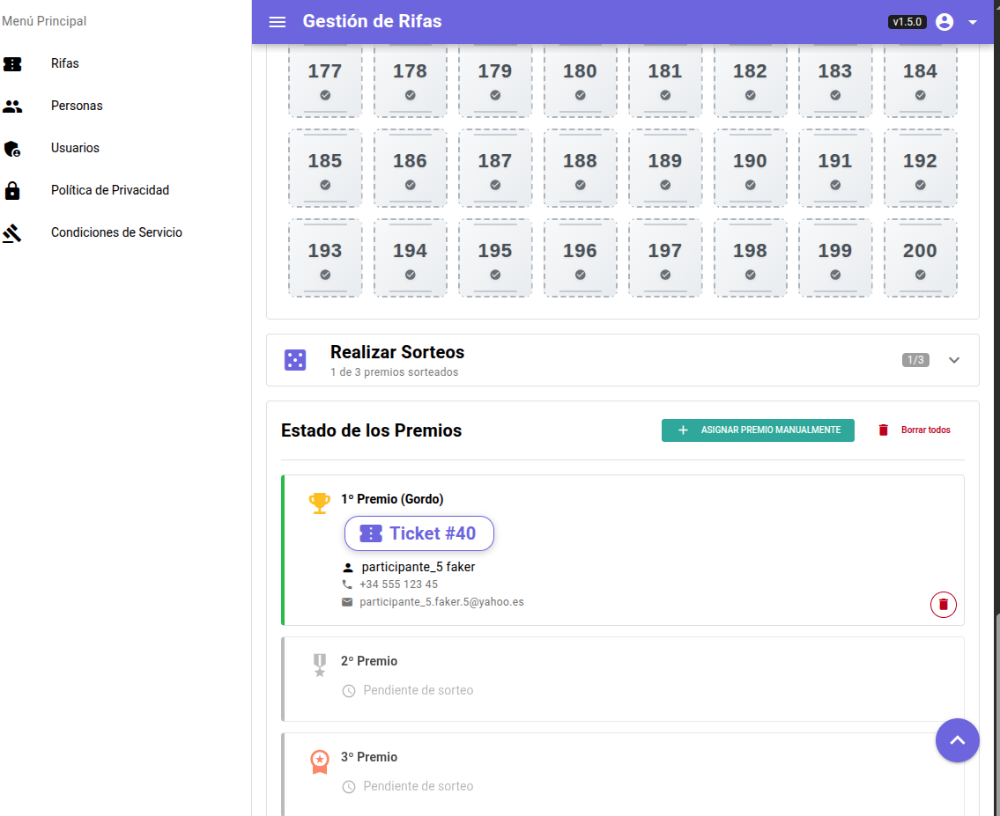
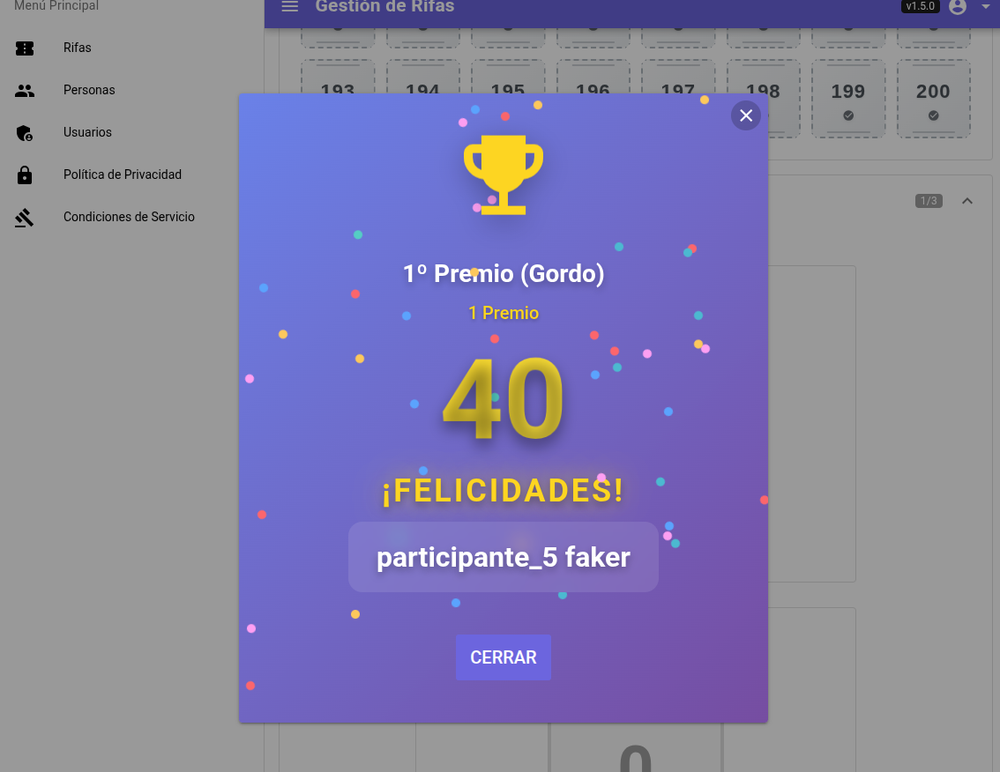
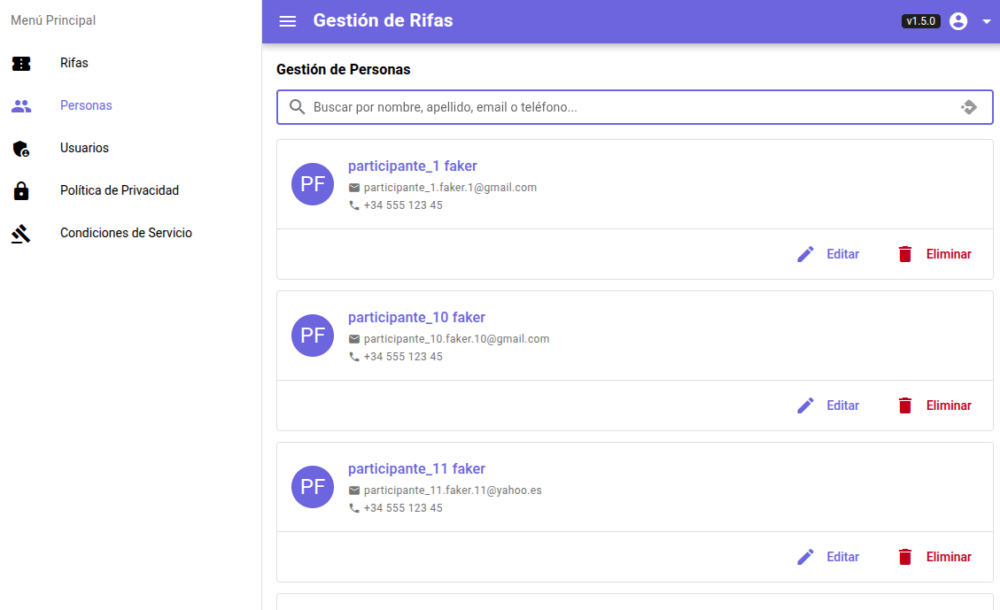
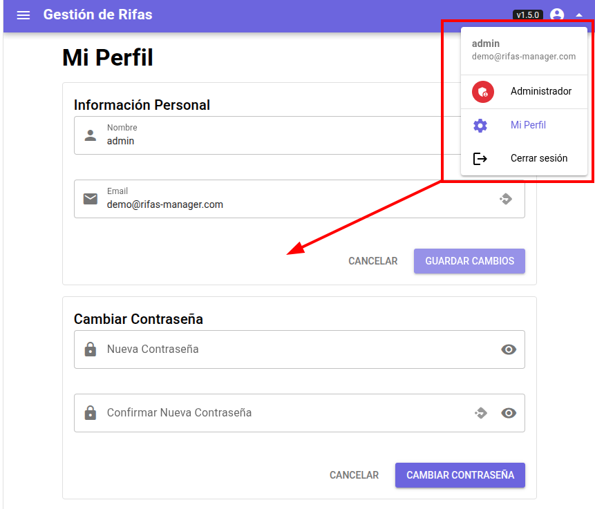

# Hackathon CubePath
[TOC]

## Descripción del proyecto

Rifas Manager es una aplicación web para la gestión de rifas.
Permite administrar sorteos, participantes, boletos y autenticación de usuarios desde una
interfaz moderna.

El proyecto está organizado como monorepo y se despliega con contenedores para facilitar
el mantenimiento y la escalabilidad.

## Estructura general

- `rifas-app`: frontend en Quasar + Vue 3.
- `rifas-api`: backend en NestJS.
- `docker/rifas`: configuración de Docker Compose y variables de entorno.

## Demo y acceso

- Demo: https://rifas-manager.jetiradoro.com
- Usuario: demo@rifas-manager.com
- Contraseña: rifasDemo#2026

## Uso de CubePath

Para este proyecto se ha utilizado CubePath sobre un VPS `gp.micro`.

En ese servidor se ha desplegado el servicio de **Dokploy** y, dentro de Dokploy, se han creado 3 servicios:

1. Servicio de frontend con Quasar y Vue 3.
2. Servicio de backend con una API desarrollada en NestJS.
3. Servicio de PostgreSQL para la persistencia de datos.

Este enfoque permite gestionar despliegues de forma centralizada, separando claramente
la capa de presentación, la lógica de negocio y la base de datos.

Así mismo para cada una de las capas se han creado los registros dns a través de **Cloudflare** en modo proxy estricto para el control de trafico de red, Y en dockploy se ha levantado el servicio con letsencrypt para la comunicación con el DNS. 

## Uso de la aplicación 

La experiencia frontend está pensada para que cualquier usuario pueda crear y resolver una rifa en pocos pasos, sin curva de aprendizaje.

### 1) Inicio de sesión

El usuario accede con sus credenciales y entra directamente al panel principal.

### Rifas

Tras hacer login se muestra el listado de rifas.
Desde esta vista se puede:

- crear una nueva rifa,
- revisar rifas existentes,
- entrar al detalle para gestionar el sorteo.

### 2) Crear una rifa

El formulario solicita únicamente los datos clave (nombre, fecha, número de boletos y premios).
El objetivo es que el alta sea rápida y guiada.

### 3) Gestionar la rifa

En el detalle se centraliza toda la operativa:

- alta y seguimiento de participantes,
- control de boletos asignados,
- revisión del estado general de la rifa.

### 4) Definir premios y ejecutar sorteo

Una vez configurados los premios, el sistema ejecuta el sorteo y muestra el resultado de forma clara para su verificación.

El ganador queda registrado y visible desde la interfaz, facilitando la trazabilidad del proceso.

### 5) Gestión de participantes

La vista de participantes permite buscar, validar y consultar el historial de cada persona para evitar errores y duplicidades.

Así como crear o eliminar participantes.

### 6) Perfil

El usuario puede consultar información de su perfil para cambiar datos de acceso. 

> En la vesrión demo se ha capado la modificación de datos. del administrador

